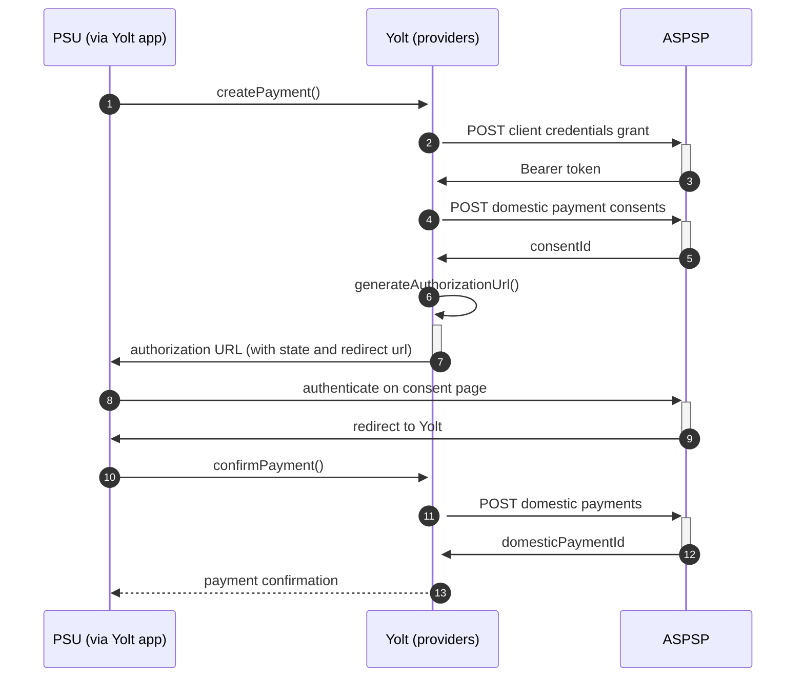

## Bank Name (PIS)
[Current open problems on our end][1]

Short description of the bank.

## BIP overview 

|                                       |                                                                                                                                  |
|---------------------------------------|----------------------------------------------------------------------------------------------------------------------------------|
| **Country of origin**                 | Country name                                                                                                                     | 
| **Site Id**                           | site ID of the bank                                                                                                              |
| **Standard**                          | [Standard][2]                                                                                                                    |
| **Contact**                           | E-mail: support@bank.com   Primary contact person: best.supporter@bank.com   Ticketing system: https://bank.com/ticketing |
| **Developer Portal**                  | https://developer.bank.com                                                                                                       |
| **IP Whitelisting**                   | Yes / No                                                                                                                         |
| **PIS Standard version**              | 1.0.0                                                                                                                            |
| **Requires PSU IP address**           | Yes / No                                                                                                                         |
| **Type of certificate**               | eIDAS / Open Banking                                                                                                             |
| **Signing algorithms used**           | PS256 / RS256                                                                                                                    |
| **Mutual TLS Authentication Support** | Yes / No                                                                                                                         |
| **Repository**                        | https://git.yolt.io/providers/bespoke-bank-name                                                                                  |

## Links - sandbox

|                       |                                        |
|-----------------------|----------------------------------------|
| **Base URL**          | https://sandbbox.bank.com/base         |
| **Authorization URL** | https://sandbbox.bank.com/authorize    | 
| **Token Endpoint**    | https://sandbbox.bank.com/token.oauth2 |  

## Links - production 

|                           |                                          |
|---------------------------|------------------------------------------|
| **Base URL**              | https://production.bank.com/base         |
| **Authorization URL**     | https://production.bank.com/authorize    | 
| **Token Endpoint**        | https://production.bank.com/token.oauth2 |  
| **Registration Endpoint** | https://production.bank.com/register     |  

## Client configuration overview

|                              |                                 |
|------------------------------|---------------------------------|
| **Authentication mean name** | Authentication mean description |

## Connection Overview

Describe bank flow. There should be information about the flow in each of our interface method. Describe supported 
transaction types, endpoints, token validity etc. Pay attention for those places where logic is specific and doesn't
look like any other provider.

Simplified sequence diagram:

   
## Sandbox overview

If sandbox was used, you have to describe here information about it. You can also explain why we skipped sandbox during
implementation of provider.

## Consent validity rules

Describe if consent testing was turned on or off and what consent validity rules are used.

## Payment Flow Additional Information

|                                                                                                        |                             |
|--------------------------------------------------------------------------------------------------------|-----------------------------|
| **When exactly is the payment executed ( executed-on-submit/executed-on-consent)?**                    | execute-on-submit           |
| **it is possible to initiate a payment having no debtor account**                                      | YES / NO                    |
| **At which payment status we can be sure that the money was transferred from the debtor to creditor?** | AcceptedSettlementCompleted |

## Business and technical decisions

Place here all business decisions which were made in this provider. Pay attention for error handling.

## External links
* [Current open problems on our end][1]
* [Standard][2]

[1]: <https://yolt.atlassian.net/issues/?jql=project%20%3D%20%22C4PO%22%20AND%20component%20%3D%20FIRST_DIRECT%20AND%20status%20!%3D%20Done%20AND%20Resolution%20%3D%20Unresolved%20ORDER%20BY%20status>
[2]: <https://standards.openbanking.org.uk/>